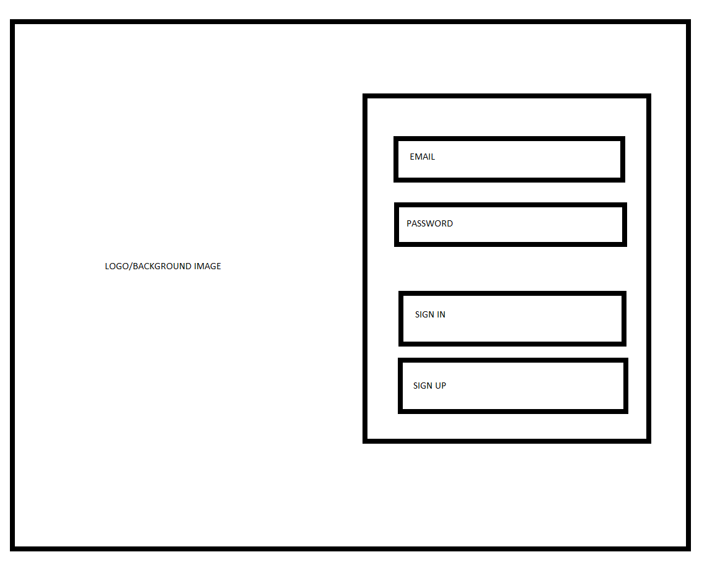
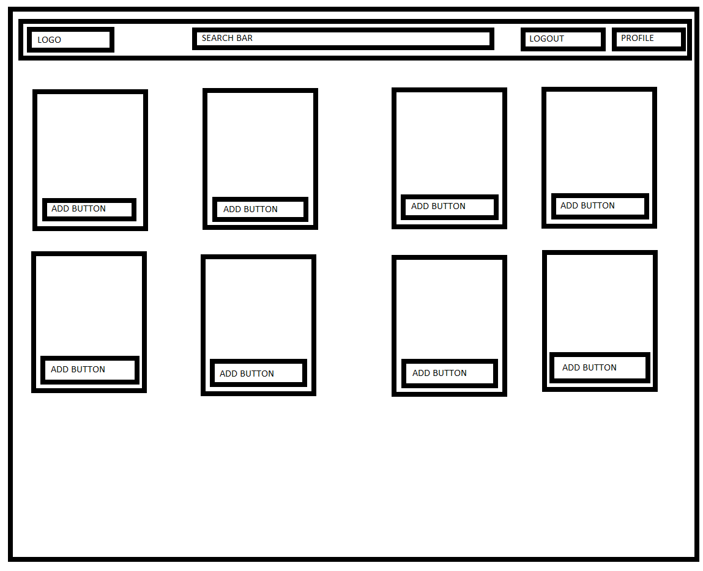
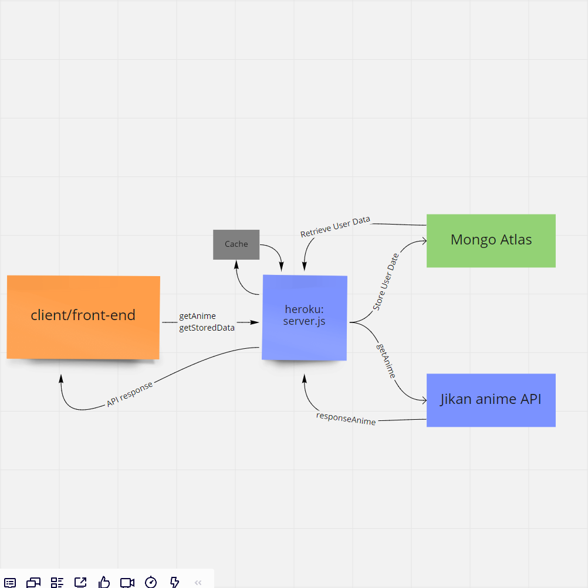
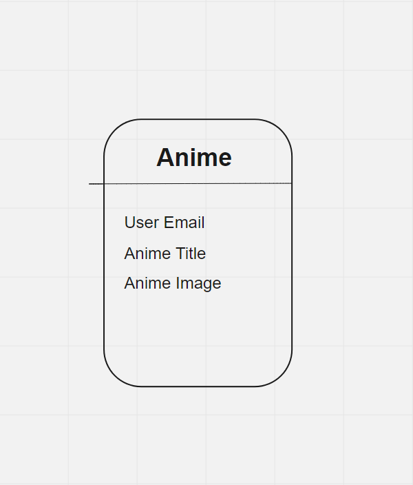

# WEEB Anime

## Creators: George Mead, Harvey Lucas, Jovincent Delmundo, Roop Hayer

## Brief description

We are creating an app where user will search for anime series by filling out a brief form or specific title which will show a list of animes. Then the user will have the option to save those animes on his watchlist on our app. 

# Wireframe

# User stories

### User story 1
Title: Anime Enthusiast 
User Story sentence:I am an avid anime watcher and sometimes I have so many recommendations to me that I can't keep track of all of them at once. I want an application that will allow me to keep track of all the recommendations for me so that I can manage what I am watching easier.
Feature Task: 
Search for and add shows to a queue 
Add shows to a watching and watched playlist
Acceptance tests: 
Ensure that the shows successfully save into database

### User Story 2

Title: Anime parent
User Story sentence: As the father of an anime fan, I need the ability to research  the shows my child watches. I would like to be able to save a list of these shows in order to keep track of them. I don’t want my queries to return any anime containing adult content.
Feature Task: Add shows to a personalized list. Filter out adult content.
Acceptance tests: 
Ensure that the shows successfully save into the database. 
Ensure that R-rated anime are filtered.

### User Story 3

Title: New Anime Fan
User Story: Many folks like me are interested in anime but overwhelmed by the amount of content available. Our application helps those who want to get into anime and manga, but are unsure of where to begin. We provide them with that starting point. Our survey asks the user a few questions about the type of content they enjoy most, and our app will give them some anime shows and movies to get started with. The user can save that information in order to track the shows they enjoy, as well as remove the ones they don’t.
Feature Task: Survey records and saves user’s answers, and uses those answers to generate a list of recommended anime titles.
Acceptance Tests: Ensure survey includes relevant questions to user’s interests and generates a list rationally related to that user’s answer.

### User Story 4

Title: Anime Worshipper 
User Story sentence:I love watching anime but once I am finished with the series, I always crave for more anime series related to the one I watched. Sometimes I see trailers and want to watch it later. I get confused picking up my next binge worthy anime. This app will let you create a profile, where you can search and save animes to your watchlist.
Feature Task:
Create a profile with username and email.
Create an empty wishlist where you can add animes.

Acceptance tests: 
Save anime list and profile on remote MongoDB.

### User story 5

Title: Manga to Anime
User Story sentence:I am reading a lot of manga but I want to transition into anime. I want an application that will allow me to look up my favorite manga that have an anime version and save them to a playlist for me to track.
Feature Task: 
Search for and add shows to a queue 
Add shows to a watching and watched playlist
Acceptance tests: 
Ensure that the shows successfully save into database

# Domain Modeling

# Database Schema
